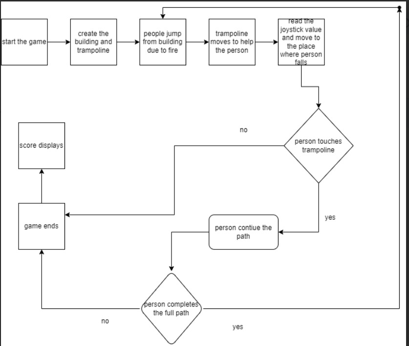

# GC_24_ARDUGEM_99.2


*Upon a calm and lively morning in the city, Ms. Murthy occupied herself with her newspaper and her cat, Muttu.*

*Out of nowhere, the apartment's siren drowned out Muttu's meows. She peeps over her window only to see people in red rushing towards the building. Keeping her head slightly cocked, she notices black smoke billowing out of the apartment above her.*

#### *Can Muttu, Ms. Murthy and her neighbours escape unharmed?*

## Devices Used

1. Arduino UNO
2. JoyStick Shield Module
3. 1.44" TFT LCD Display
4. Breadboard
5. Jumper Wires
6. USB Cable for Arduino UNO

## Circuit Connections 

1. Link for connecting Arduino with JoyStick Shield Module:  
[Connect Arduino with JoyStick Shield Module](https://electropeak.com/learn/interfacing-dual-axis-joystick-shield-with-arduino/)
2. Image for connecting 1.44" TFT LCD Display with JoyStick Shield Module:-


See the circuit diagram for more clarity:-


## Gameplay

### Block Diagram
Block Diagram describing the function of the game:-


### Description
Inspired from the arcade game ping-pong, in this game the player's end goal is to save as many people as possible by moving the trampoline sideways to save people who are jumping off the balcony of a building caught on fire. The trampoline movement is controlled by the joystick. There are a total of five floors (ground to top fourth floor) and people are jumping from the first, second, third, and fourth floors at random (no fixed sequence given). The player has to move the trampoline such that the people jumping off don't touch the ground and are made to land safely. The more the number of people saved, the more the score. In case a person touches the ground rather than falling on the trampoline, the game ends and your score is displayed on the screen.

## Game Features
### Score Tracking:
The game keeps track of the player's score, which increases as they successfully save people. When the game ends, the player's score is shown.

### Variable complexity:
The complexity appears to fluctuate dynamically, as seen by the random delays (0,3) before a path begins, as well as the random selection of paths. This variety keeps the game tough and interesting.

### Simple Control Mechanism:
The game's control is based on analog joystick input, making it simple to play. The joystick controls the trampoline's horizontal movement across the screen.

### Retro Arcade Style:
The game's design purposely resembles classic arcade games, with basic, bright graphics. It pays homage to the golden period of arcade gaming with a vintage color scheme of red, white, and black, combining compelling gameplay with a minimalist design. This option provides a seamless experience on every device while requiring minimal RAM. The ball represents curled up people, the blue block at the bottom the trampoline, and the grey and white strips the building.

### Simple Design:
The looks of the game adheres to the notion that a simpler design can lead to increased user engagement and better UX interactions. The uncluttered UI focuses attention on the gameplay, which improves the entire user experience, thus player's playing it for longer hours.

### Score-Based Gameplay:
The focus on scoring and the display of the final score provide an incentive for players to improve their performance, encouraging replayability.

### Physics-Based Obstacle Movement:
Using quadratic functions to control the movement of obstacles adds a physics component to the game, simulating acceleration and making gameplay more realistic.

### End of the Game
The game would end when the ball falls out of the screen.

## Code Manual

The code in this repository is divided into the following structure

### Directory Structure

```.
├── main
│   └── main.ino
├── README.md
├── TABLE.jpg
├── TinkerCad.pdf
├── blockDiagram.jpg
├── connections.jpg
├── intro.jpg
```

### Instructions to run the code

- The main code is in the main folder.
- Open the main.ino file in the arduino IDE.
- Connect the arduino to the computer.
- Upload the code to the arduino.
- Open the serial monitor and set the baud rate to 9600. (OPTIONAL)
- The game should start on the tft display.

### Files

#### main
- This folder contains the main code for the game.
- It has all the libraries and headers bundled in the main.ino file.

#### TABLE.jpg
- This file is of the table for connections for 1.44" TFT LCD Display with JoyStick Shield Module.
- Also can be seen under the heading 'Circuit Connections'.

#### TinkerCad.pdf
- This file is of the circuit connections made in pdf form.

#### blockDiagram.jpg
- This file is an image showing the game mechanism.
- Also can be seen under the heading 'Game Play'.

#### connections.jpg
- This file is same as 'TinkerCad.pdf' except in image (jpg) format.
- Also can be seen under the heading 'Circuit Connections'.

#### intro.jpg
- It is the cover page image.
- Also can be seen at the very start of this file.

## Libraries Used

- **SPI**: This library facilitates communication with serial peripheral devices.
- **TFT**: This library is used for interfacing with TFT LCD screens.
